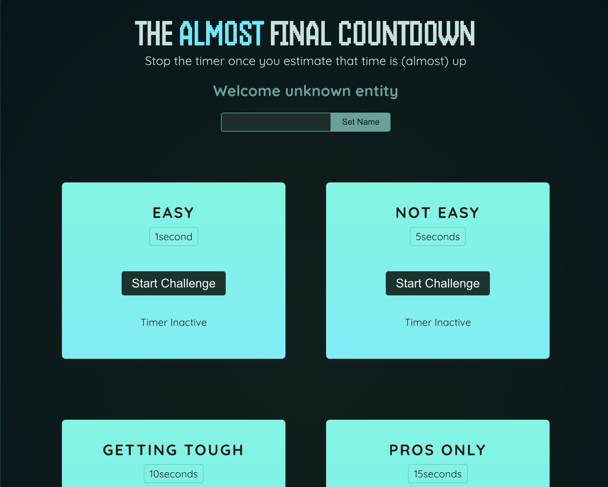

# Beat The Clock

Beat The Clock is a timing-based game where players must stop a timer as close to the target time as possible. The game tests your precision and reaction speed!

## Features
- Start and stop a countdown timer.
- Dynamic feedback on success or failure.
- Modal displaying the result after the challenge.

## Demo


## How to Play
1. Click the "Start Challenge" button to begin the countdown.
2. Stop the timer as close to zero as possible.
3. The result will display whether you "Won" or "Lost" based on your timing.

## Installation
1. Clone the repository:
   ```bash
   git clone https://github.com/Akshay-hackelite/BeatTheClock.git
   Navigate to the project directory:

2.Install dependencies (if applicable):
    npm install

3.Run the development server:
  npm start

